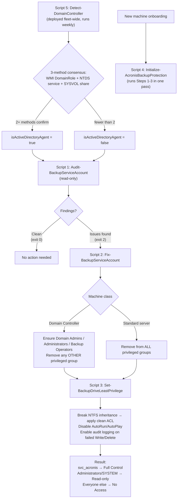

# 🔐 Acronis Backup Security Framework

A 5-script PowerShell framework, orchestrated via NinjaOne, that enforces **least privilege** and **privilege separation** on Acronis Cyber Protect Cloud backup infrastructure across a multi-client MSP fleet.

---

## The Problem

Backup infrastructure is a common blind spot in security hardening. The Acronis backup service account routinely ends up over-privileged, and sometimes a member of local `Administrators` or even `Domain Admins`, simply because it's easier to grant broad access than to scope it correctly. If that account is ever compromised, an attacker doesn't just lose backups; they get a path to the rest of the environment.

This problem also doesn't have a single answer across an MSP fleet, because not every machine is the same:

- **Standard servers/workstations**: the backup account should have *zero* privileged group membership.
- **Domain Controllers running Acronis Agent for Active Directory**: Acronis explicitly *requires* the backup account to be in `Domain Admins`, `Administrators`, and `Backup Operators` (per Acronis KB 56202). Flagging this as a "finding" would be a false positive.
- **VM guests**: the backup drive isn't even local; it lives on the Hyper-V host.

A single hardening script can't safely treat all of these the same way.

## The Solution

A framework that **classifies the machine first, then applies the correct hardening logic for that class** —> fully automated and orchestrated fleet-wide through NinjaOne.

### Architecture

*(New machines run Script 4, which combines account creation, group remediation, and drive hardening in a single onboarding pass. Existing machines are periodically re-audited with Script 1, with Scripts 2/3 used for targeted remediation only where needed.)*

### The 5 Scripts

| # | Script | Purpose | Mode |
|---|--------|---------|------|
| 1 | `Audit-BackupServiceAccount.ps1` | Checks the backup account's group memberships against the expected baseline for its machine class. Read-only, makes no changes. | Detection |
| 2 | `Fix-BackupServiceAccount.ps1` | Remediates account-level findings: removes unwanted privileged group memberships, adds required ones for DCs, enables the account, sets password-never-expires. | Remediation (account only) |
| 3 | `Set-BackupDriveLeastPrivilege.ps1` | Breaks NTFS inheritance on the backup destination and applies a least-privilege ACL: backup account gets Full Control, Admins/SYSTEM get Read-only, everyone else gets nothing. Also disables AutoRun/AutoPlay and enables audit logging for failed write/delete attempts. | Remediation (drive only) |
| 4 | `Initialize-AcronisBackupProtection.ps1` | Full onboarding script for new machines that combines account creation/hardening and drive hardening into a single deployment, branching on machine class automatically. | Full setup |
| 5 | `Detect-DomainController.ps1` | The entry point of the framework. Classifies each machine using a 3-method consensus check (WMI `DomainRole`, `NTDS` service status, presence of the `SYSVOL` share) and writes the result to a NinjaOne custom field that the other 4 scripts read. | Classification |

### Key Design Decisions

- **Audit and remediation are separate scripts.** Script 1 never makes changes, it only reports. This means it's safe to schedule on every machine on a recurring basis (e.g. weekly) for continuous compliance checking, without risk of unintended changes.
- **Machine classification is automated, not assumed.** Rather than manually tagging which servers are Domain Controllers, Script 5 runs its own 3-method consensus check and keeps a NinjaOne custom field (`isActiveDirectoryAgent`) current. Every other script reads this field instead of guessing.
- **NTFS permissions, not just group membership, are the real control.** On a Domain Controller, the backup account *must* be a Domain Admin for Acronis's Agent for Active Directory to function, but Domain Admins membership doesn't grant it backup-folder access beyond the explicit ACL. The framework relies on NTFS as the actual enforcement boundary, with group membership treated as a separate (and necessary) concern.
- **Every action is logged.** Each script writes timestamped, leveled logs to `C:\Logs`, giving a clear audit trail of what was found and what was changed on every run — useful both for compliance and for troubleshooting client escalations.

---

## Tech Stack

- **PowerShell**: all 5 scripts
- **NinjaOne**: orchestration, scheduling, custom fields, secure variable storage for credentials
- **Acronis Cyber Protect Cloud**: backup platform being secured
- **Active Directory**: `Get-ADUser`/`Get-ADGroupMember` for domain-joined machine handling
- **Windows NTFS / `auditpol`**: access control and audit logging enforcement

## Results

- Deployed fleet-wide across all NinjaOne-managed servers running local backups to an external destination drive
- Eliminated unscoped backup service account privileges across the managed environment
- Replaced manual, error-prone "is this a DC?" judgment calls with an automated, self-correcting classification system
- Established a documented SOP (with flowchart) so the process is repeatable and auditable, not tribal knowledge

## Documentation

A full Standard Operating Procedure (SOP) with a process flowchart accompanies this framework, covering deployment order, NinjaOne custom field/variable setup, and escalation steps when a script exits with a non-zero code.

---

## Scripts

See [`/scripts`](./scripts) for the full PowerShell source.

> Note: all scripts read secrets via NinjaOne secure script variables (`Ninja-Property-Get`) —> no credentials are hardcoded anywhere in this framework.
